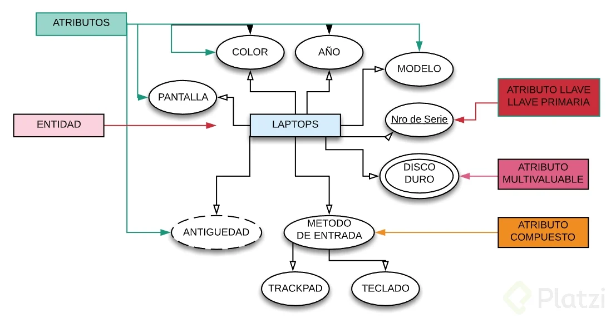
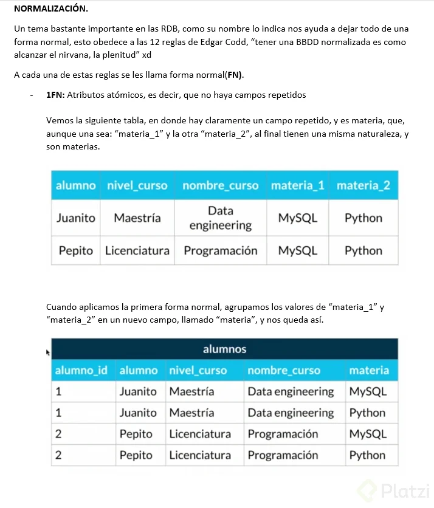
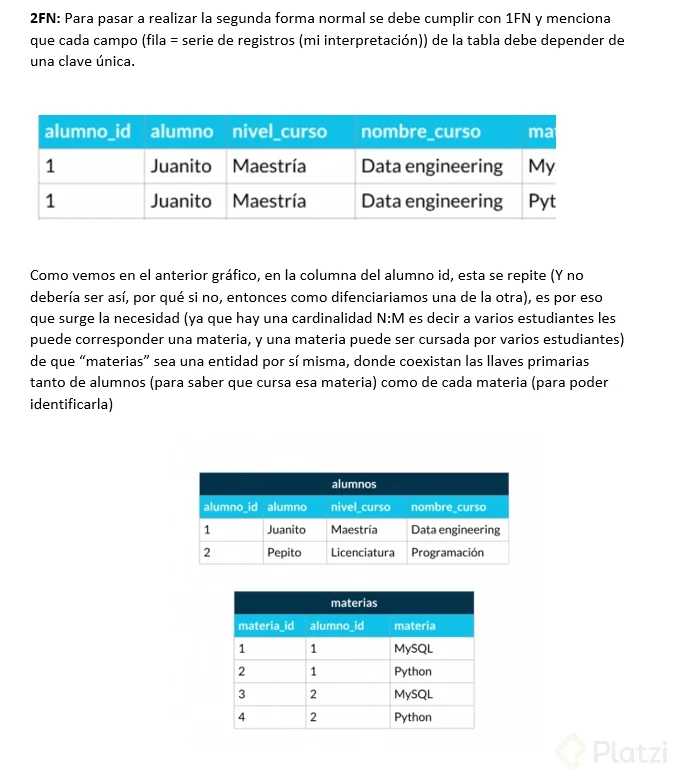
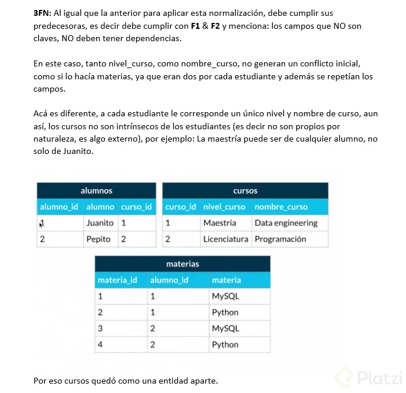
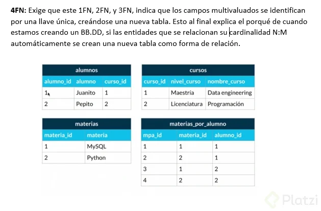
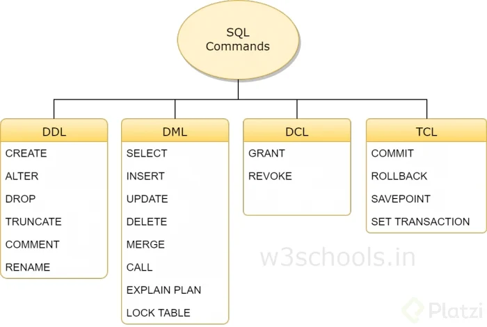
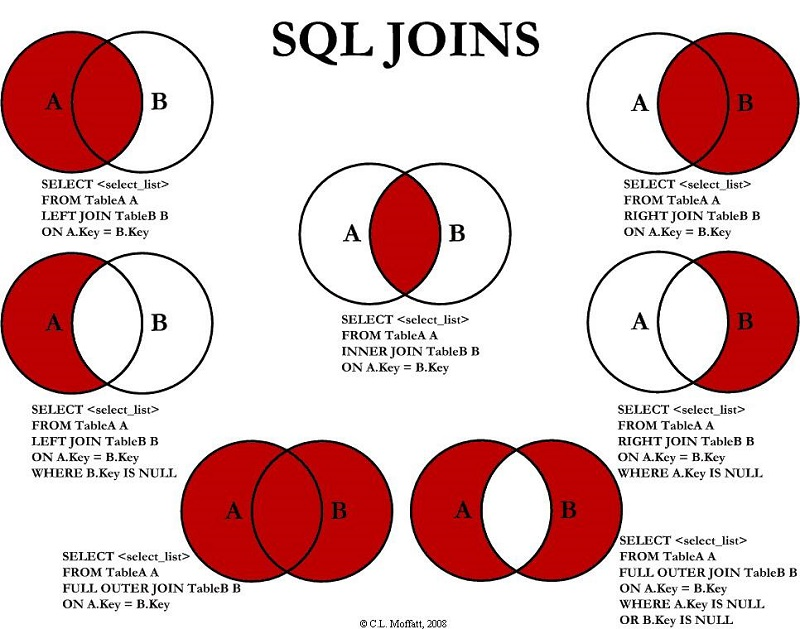
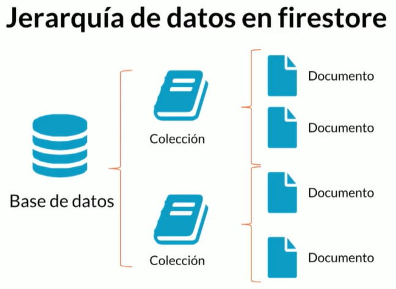

# 1. Bases de datos

Surgieron de la necesidad de almacenar información, estas son en parte la transición de las máquinas locales hacia la nube, en cuestión de servicios están los auto administrados, que son más propios y los administrados que son servicios que venden Google, Azure, AWS

## 1.1. Relacionales

- SQL Server
- MariaDB
- Postgres
- MySQL
- Oracle

Surgieron de la necesidad de tener una estructura clara para guardar datos.

Edgar Frank Codd fue quien creó las bases para este tipo de estructuras, junto con el álgebra relacional y las [12 reglas](https://medievalstrucos.com/2013/07/18/12-reglas-de-codd-para-bases-de-datos-relacionadas/) para estas bases.

### 1.1.1. Entidades y atributos

Una entidad se puede asociar a un objeto que representa un elemento, un objeto o algo de la vida real



**Entidad**: es un objeto que existe y es distinguible de otros objetos (se encierra en un recuadro) 

**Atributos**: Características o propiedades que describen a la entidad (se encierra en un ovalo) 

**Atributo multivaluado**: Tiene un conjunto de valores para una entidad (Se encierra en un doble ovalo) 

**Atributo compuesto**: Se puede dividir en subpartes (es decir, en otros atributos) (de él salen otros atributos) 

**Atributo especial o derivados**: Su valor se puede obtener a partir de valores de otros atributos (se encierra en un ovalo punteado) 

**Atributos llave**: Característica o propiedad única de la entidad, lo que lo diferencia de los demás 

**Atributos llave naturales**: Son parte de la entidad y no se pueden separar. 

**Atributo llave artificial**: No son partes de la entidad y se les asignan de manera arbitraria para facilitar el manejo de la información.

**Entidades fuertes**: son entidades que pueden sobrevivir por si solo, tip: al leer la tabla sabes que son las entidades (se encierra en un recuadro) 

**Entidades débiles** : no puede existir sin una entidad fuerte, tip: al leer la tabla no puedes saber que son las entidades (se encierra en un recuadro doble)

**Entidades débiles por identidad**: es cuando solo se diferencian entre si por la clave de su entidad fuerte 

**Entidades débiles por existencia**: se le da su propio ID para diferenciarse de la entidad fuerte

Relaciones

Las relaciones, representadas por un rombo, sirven para crear relaciones entre entidades. Por convención las relaciones son verbos que conectan entidades. Existen entidades multivaluadas o compuestas que tienen vida propia y se relacionan con otras entidades, por lo que se pueden normalizar (concepto que se explicará luego)

Cardinalidad

Es una propiedad de las relaciones que indica la cantidad y correspondencia con la que puede estar relacionada una entidad y puede ser uno a uno, uno a varios, varios a uno y varios a varios.

### 1.1.2. Tipos de datos

Para llevar a la práctica un diagrama debemos ir más allá y darle detalle con parámetros como:

Tipos de dato:

- **Texto**: CHAR(n), VARCHAR(n), TEXT
- **Números**: INTEGER, BIGINT, SMALLINT, DECIMAL(n,s), NUMERIC(n,s)
- **Fecha/hora**: DATE, TIME, DATETIME, TIMESTAMP
- **Lógicos**: BOOLEAN

**Constraints (Restricciones)**

- **NOT NULL**: Se asegura que la columna no tenga valores nulos
- **UNIQUE**: Se asegura que cada valor en la columna no se repita
- **PRIMARY KEY**: Es una combinación de NOT NULL y UNIQUE
- **FOREIGN KEY**: Identifica de manera única una tupla en otra tabla

    Las acciones que se pueden realizar en el update y en el delete de una clave foránea son las siguientes:

    - **CASCADE**: Si se elimina o actualiza un registro de la tabla de referencia, todos los registros de la tabla principal que hacen referencia al registro eliminado o actualizado también se eliminarán o actualizarán.
    - **SET NULL**: Si se elimina o actualiza un registro de la tabla de referencia, el valor de la clave foránea en la tabla principal se establecerá en NULL.
    - **RESTRICT**: Se impedirá que se elimine o actualice el registro de la tabla de referencia si hay registros de la tabla principal que hacen referencia al registro.
    - **NO ACTION**: No se realizará ninguna acción si se elimina o actualiza un registro de la tabla de referencia si hay registros de la tabla principal que hacen referencia al registro.
- **CHECK**: Se asegura que el valor en la columna cumpla una condición dada
- **DEFAULT**: Coloca un valor por defecto cuando no hay un valor especificado
- **INDEX**: Se crea por columna para permitir búsquedas más rápidas

### 1.1.3. Normalización

a normalización como su nombre lo indica nos ayuda a dejar todo de una forma normal. Esto obedece a las 12 reglas de Codd y nos permiten separar componentes en la base de datos:

**Primera forma normal (1FN)**: Atributos atómicos (Sin campos repetidos)



**Segunda forma normal (2FN)**: Cumple 1FN y cada campo de la tabla debe depender de una clave única.



**Tercera forma normal (3FN)**: Cumple 1FN y 2FN y los campos que NO son clave, NO deben tener dependencias.



**Cuarta forma normal (4FN)**: Cumple 1FN, 2FN, 3FN y los campos multivaluados se identifican por una clave única.



### 1.1.4. Comandos




#### 1.1.4.1. DDL

- [Create](creating_tables.sql)
    - Database: Repositorio de datos.

        ```SQL
        CREATE DATABASE test_db;
        USE DATABASE test_db;
        ```

    - Table: Traducción a SQL de los diagramas ER

        ```SQL
        CREATE TABLE `market`.`product` (
            `product_id` INT NOT NULL AUTO_INCREMENT,
            `name` VARCHAR(45) NOT NULL,
            `sell_price` INT NOT NULL,
            `category` VARCHAR(45) NOT NULL,
            PRIMARY KEY (`product_id`));

        CREATE TABLE people (
            person_id INTEGER PRIMARY KEY AUTOINCREMENT NOT NULL,
            last_name VARCHAR(255),
            first_name VARCHAR(255),
            address VARCHAR(255),
            city VARCHAR(255)
        );
        ```

    - View: Proyección de la base de datos para ser más entendible.

    ```SQL

    CREATE VIEW v_food_products AS
        SELECT name,sell_price
        FROM products
        WHERE category ="food";

    CREATE VIEW v_brasil_customers AS
        SELECT customer_name,contact_name
        FROM customers
        WHERE country ="Brasil";
    ```

- Alter

Modifica una tabla.

```SQL
ALTER TABLE `market``product` 
ADD COLUMN `expiration` DATETIME NULL AFTER `category`;

ALTER TABLE `market`.`product` 
DROP COLUMN `expiration`;
```

- Drop

Borra algún elemento.

```SQL
DROP TABLE people;
DROP DATABASE test_db;
```

#### 1.1.4.2. DML

Trata de ingresar, borrar y extraer datos de la DB

- [Insert](product.sql)

```SQL

INSERT INTO table_name(col, col)
    VALUES 
    (val, val),
    (val, val)

-- En este caso product_id no es necesario debido a que lo tenemos con auto increment
-- En caso de que una columna no se ponga, a este se le asigna un valor default
INSERT INTO product(product_id, name, sell_price, category)
    VALUES 
    (1, "Manzana", 4500, "food"),
    (2, "Pera", 3800, "food")

```
- Update

```SQL
UPDATE table_name
    SET col = val, col = val
    WHERE condition;

UPDATE product
    SET sell_price = 12000, name = "Pasta"
    WHERE product_id = 1;
```

- Delete

```SQL
DELETE FROM table_name; -- Borrar tabla

DELETE FROM table_name WHERE condition;


DELETE FROM product; -- Borrar tabla

DELETE FROM product WHERE product_id = 1;
```

- Select

```SQL
SELECT col1, col2, COUNT(*) AS total_rows FROM table_name WHERE condition;

SELECT * FROM market.product WHERE category = "food" AND name LIKE "%Aceite$";

SELECT id_product, SUM(stock) AS cantidad FROM market.product_supplier GROUP BY id_product;

-- Entre valores
SELECT 
    name, stock
FROM
    product_supplier
        JOIN
    product ON product.product_id = product_supplier.product_id
WHERE
    stock BETWEEN 1 AND 5
ORDER BY name ASC; -- DESC

-- Con tabla transitiva
SELECT 
    product.name AS producto, stock AS cantidad, supplier.name AS proveedor, supplier.company AS empresa
FROM
    product_supplier
        JOIN
    product ON product.product_id = product_supplier.product_id
    JOIN supplier ON product_supplier.nit_supplier = supplier.nit_supplier;

-- Encontrar nulos
SELECT * FROM product WHERE category IS NULL;

-- Agrupar por producto, mostrar la cantidad de proveedores y el stock total
SELECT 
    name,
    COUNT(nit_supplier) AS cantidad_proveedores,
    SUM(stock) AS total_producto
FROM
    product_supplier
        JOIN
    product ON product.product_id = product_supplier.product_id

GROUP BY product_supplier.product_id
HAVING total_producto > 100;

-- GROUP_CONCAT para ver todos los valores de la agrupación
SELECT p.name, SUM(ps.stock) AS cantidad , GROUP_CONCAT(s.name) AS proveedor FROM product AS p
JOIN product_supplier AS ps ON p.product_id = ps.product_id
JOIN supplier AS s ON s.nit_supplier = ps.nit_supplier
GROUP BY p.product_id; 
```
##### JOIN



## 1.2. No relacionales

- Cassandra
- DynamoDB
- BigQuery
- MongoDB
- Neo4j

Son bases de datos más modernos

### Clave-valor
Son ideales para extraer datos con una clave única, como lo es un diccionario, para este se usa DynamoDB (AWS) y Cassandra (Facebook), se basa en algoritmos de hash
### Basadas en documentos
Con documento se refiere a objetos de tipo JSON y XML de tipo clave valor semiestructurada, son las más utilizadas en NoSQL, para estas se usan MongoDB y Firestore (Nube), es muy usado para guardar el estado actual de una aplicación, pero no es tan bueno para hacer búsquedas u ordenamiento

#### [Firebase](https://firebase.google.com/)



##### Top Level collections

Son las collecciones inmediatas del proyecto

### Basadas en grafos
Son bases de datos que son útiles para manejar entidades interconectadas por múltiples relaciones de forma compleja, se usa mucho en la IA para simular relaciones y redes neuronales, se usa neo4j y TITAN

### En memoria
Su estructura es variada, su ventaja radica en velocidad al extraer datos, pero a cambio perjudica la integridad de los datos ya que si se reinicia el servidor hay que llevar los datos nuevamente a memoria, indexar los datos, se usa Memcached y Redis

### Optimizadas para búsquedas

Su estructura es variada, su ventaja es que crea queries muy complejos de manera sencilla, generalmente para ver tendencias de negocios, bussiness inteligence y machine learning, se usa BigQuery, que es similar a SQL y se puede generar modelos de ML facilmente y Elasticsearch